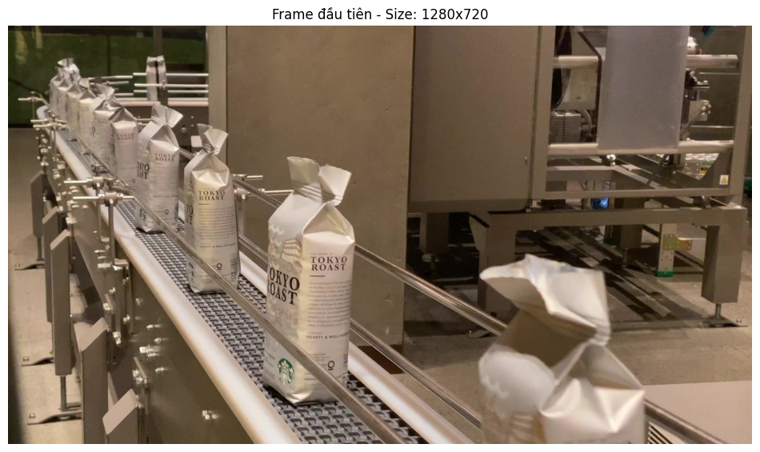
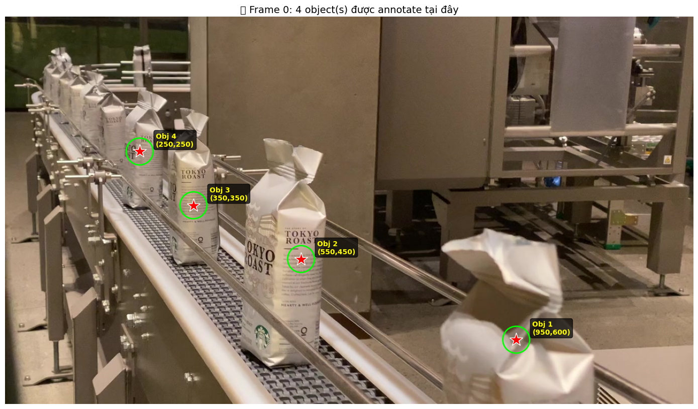
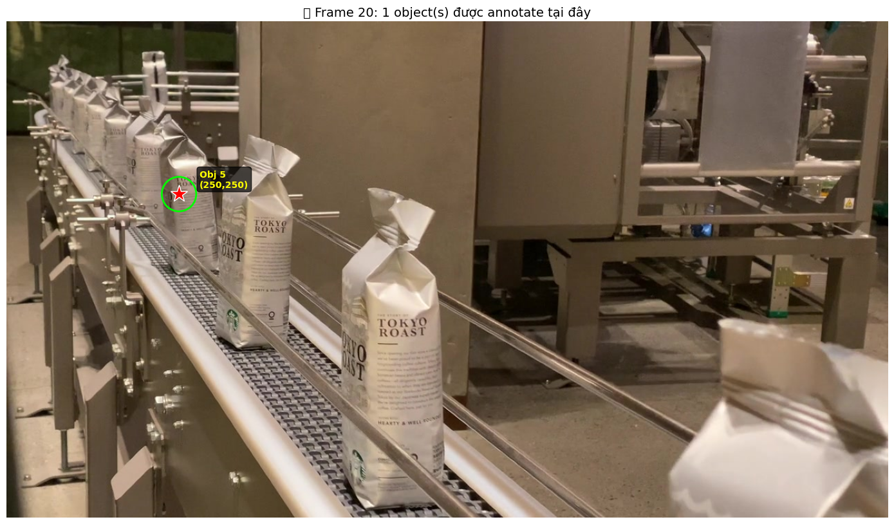
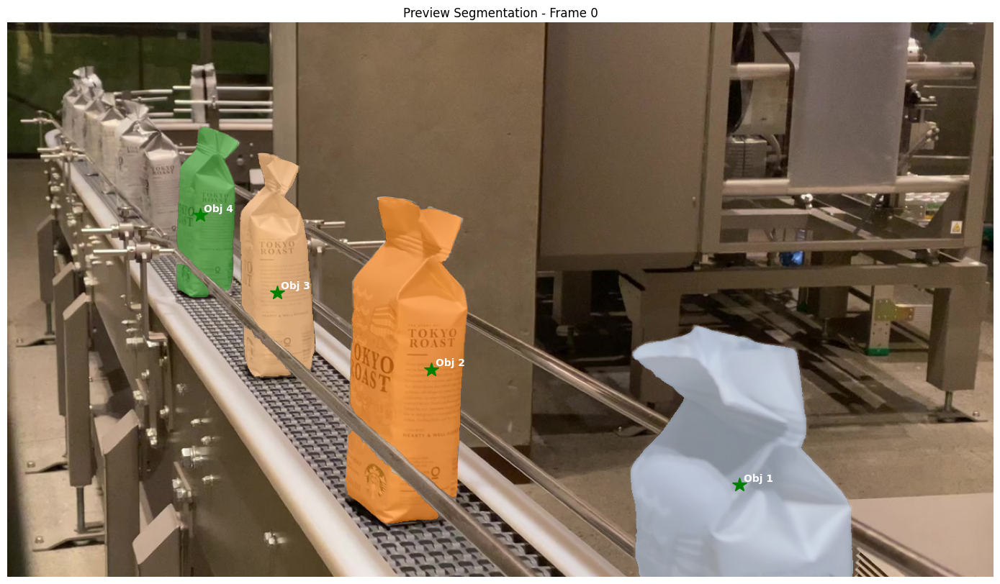
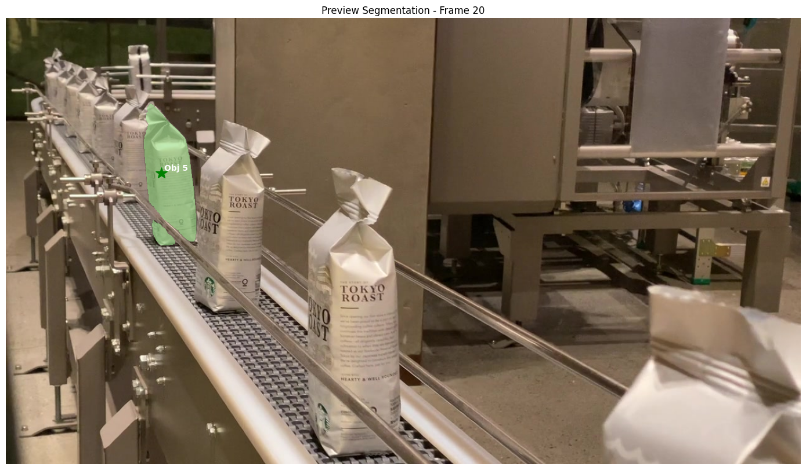
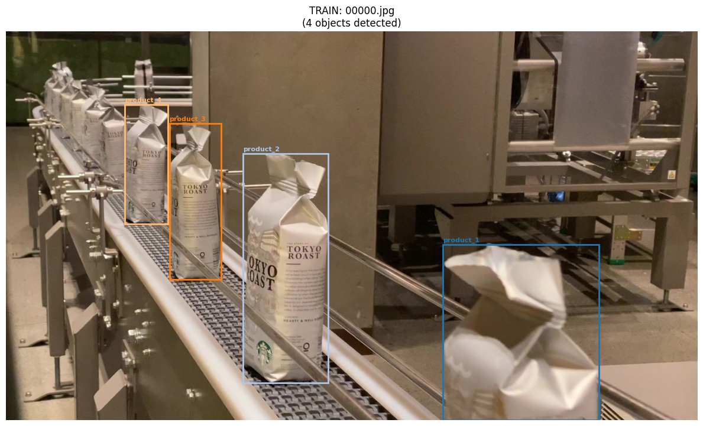
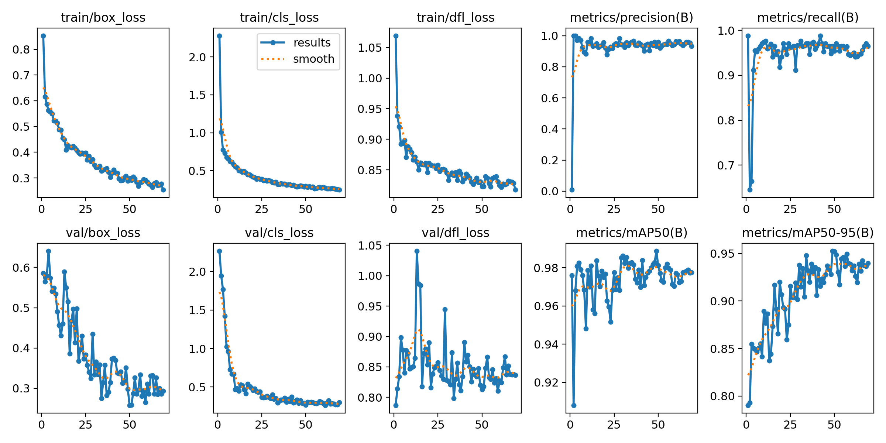
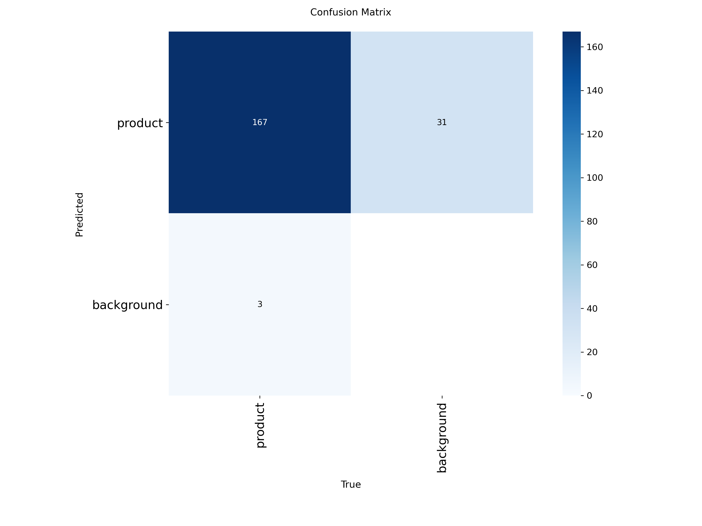

# 🏭 SAM2 + YOLO Phát Hiện Sản Phẩm Công Nghiệp

Một dự án học sâu toàn diện để phát hiện sản phẩm công nghiệp sử dụng các mô hình **YOLO v11**. Sáng tạo cốt lõi là tận dụng **khả năng gán nhãn Few-Shot của SAM 2** để loại bỏ việc gán nhãn thủ công tẻ nhạt. Chỉ cần click vài lần trên một frame video, và SAM 2 sẽ tự động tạo ra hàng trăm mẫu được gán nhãn bằng cách lan truyền mặt nạ trên toàn bộ chuỗi video.

## 📋 Tổng Quan Dự Án

Dự án này kết hợp hai mô hình AI mạnh mẽ:
- **SAM 2 (Segment Anything Model 2)**: Gán nhãn video Few-Shot với tự động tracking đối tượng
- **YOLOv11**: Phát hiện sản phẩm công nghiệp thời gian thực

### ⚡ Bước Ngoặt: Gán Nhãn Few-Shot

Phát hiện đối tượng truyền thống yêu cầu **hàng ngàn chú thích bounding box thủ công** - một quá trình tẻ nhạt và tốn kém. Dự án này cách mạng hóa quy trình đó:

- **Cách Tiếp Cận Truyền Thống**: 1.000+ hình ảnh × 5-10 phút mỗi hình = **80+ giờ gán nhãn thủ công** 😫
- **Cách Tiếp Cận Few-Shot SAM 2**: Click 2-3 lần trên 1 frame → SAM 2 tạo 500+ mẫu được gán nhãn tự động ✨
- **Tiết Kiệm Thời Gian**: Từ **tuần làm việc** xuống **phút** - giảm tới **99% thời gian gán nhãn!**

### Quy Trình
1. **Gán Nhãn Video Few-Shot** sử dụng SAM 2 (lan truyền tự động qua các frame)
2. **Tạo tập dữ liệu** ở định dạng YOLO (tự động export từ mặt nạ phân đoạn)
3. **Huấn luyện mô hình** với YOLOv11 (các biến thể Nano và Small)
4. **Suy luận** trên hình ảnh và video với khả năng phát hiện thời gian thực

---

## 🔄 Tổng Hợp Quy Trình

### 1️⃣ GÁN NHÃN VIDEO - FEW-SHOT VỚI SAM 2 ⚡
*Notebook: `video_detector.ipynb`*

**Phép Màu**: Gán nhãn một lần, tự động tạo hàng trăm mẫu!

↓
→ Chọn 1 frame + Click các đối tượng (few-shot)
→ SAM 2 tự động track & segment trên toàn bộ video
→ Tự động export định dạng YOLO

**Bước 1: Frame Gốc**

*Một frame từ video gốc hiển thị sản phẩm công nghiệp trên dây chuyền lắp ráp.*

**Bước 2: Phân Đoạn Tương Tác Few-Shot**

*Chỉ cần click 2-3 lần để chọn đối tượng trong frame đầu tiên. SAM 2 tự động phát hiện và phân đoạn sản phẩm. Không cần gán nhãn cho bất kỳ frame nào khác!*

**Bước 3: Lan Truyền Tự Động (Công Việc Nặng Nhất)**

*SAM 2 tự động theo dõi và lan truyền mặt nạ qua tất cả các frame video (có thể 500+ frames!), xử lý chuyển động, tắc nghẽn, và tất cả phức tạp mà không cần can thiệp của người dùng. Mỗi frame = 1 mẫu được gán nhãn!*

**Bước 4: Tập Dữ Liệu Tự Động Tạo**

*Kết quả cuối cùng: Từ một clip video ngắn (30 giây), SAM 2 tạo ra 500+ mẫu được gán nhãn sẵn sàng huấn luyện. Bounding boxes được vẽ từ mặt nạ phân đoạn và tự động export ở định dạng YOLO.*

**💡 Lợi Ích Chính**: Thay vì phải gán nhãn thủ công từng frame, bạn chỉ cần 5 phút tương tác → nhận được tập dữ liệu hoàn chỉnh!

---

### 2️⃣ CHUẨN BỊ TẬP DỮ LIỆU (Tự Động Tạo)
*Thư Mục: `industrial_product_dataset/`*

↓
→ Hình ảnh tự động tạo từ các frame video
→ Chú thích tự động tạo (định dạng YOLO .txt)
→ Cấu hình data.yaml tự động tạo

Dữ liệu được tự động export từ mặt nạ phân đoạn SAM 2 thành định dạng YOLO chuẩn. **Toàn bộ quá trình chỉ mất vài phút - không cần gán nhãn thủ công!**

---

### 3️⃣ HUẤN LUYỆN MÔ HÌNH
*Notebook: `train_yolo.ipynb`*

↓
→ Huấn luyện YOLOv11n
→ Huấn luyện YOLOv11s
→ Chỉ số hiệu suất

Huấn luyện các biến thể mô hình YOLO khác nhau sử dụng tập dữ liệu được tự động tạo.

**Kết Quả Huấn Luyện & Chỉ Số:**

*Biểu đồ hiệu suất huấn luyện - hiển thị mAP, precision, và recall qua các epochs.*

**Xác Thực Mô Hình - Ma Trận Nhầm Lẫn:**

*Ma trận nhầm lẫn từ tập xác thực - phân tích chi tiết hiệu suất phân loại của mô hình.*

---

### 4️⃣ SƯỚC LUẬN & TRIỂN KHAI
*Notebook: `inference.ipynb` hoặc `inference_video.ipynb`*

↓
→ Tải trọng số đã huấn luyện
→ Chạy dự đoán
→ Trực quan hóa kết quả
→ Xuất kết quả

**Video Phát Hiện & Theo Dõi Thời Gian Thực:**

#### 🎯 Phát Hiện - Bounding Boxes
Video hiển thị bounding boxes phát hiện - mô hình YOLOv11 phát hiện sản phẩm công nghiệp với bounding boxes và điểm tin cậy.

📹 **[Xem: inference_detected.mp4](assets/inference_detected.mp4)** - Bấm để xem video trong trình duyệt

---

#### 📊 Đếm & Theo Dõi
Video với đếm đối tượng và theo dõi - giám sát số lượng sản phẩm qua các frame và đếm tổng số sản phẩm được phát hiện.

📹 **[Xem: inference_counting_tracking.mp4](assets/inference_counting_tracking.mp4)** - Bấm để xem video trong trình duyệt

## 📝 Giấy Phép

Dự án này sử dụng:
- **YOLOv11**: Ultralytics (AGPL-3.0)
- **SAM 2**: Meta (Apache 2.0)

Đảm bảo tuân thủ các giấy phép tương ứng cho trường hợp sử dụng của bạn.

---

## 🎓 Tài Liệu Tham Khảo

- [Tài Liệu YOLOv11](https://docs.ultralytics.com/models/yolov11/)
- [SAM 2: Segment Anything Model 2](https://github.com/facebookresearch/sam2)
- [Đặc Tả Định Dạng YOLO](https://docs.ultralytics.com/datasets/detect/)
- [Định Dạng ONNX](https://onnx.ai/)

## 🙏 Lời Cảm Ơn

- **Cảm Hứng & Khái Niệm Dự Án**: Cách tiếp cận của dự án này được lấy cảm hứng từ phương pháp gán nhãn video few-shot sáng tạo được chia sẻ bởi [vietnh1009](https://github.com/vietnh1009) trong [bài viết X/Twitter này](https://x.com/IlirAliu_/status/1993250285200818394). Khái niệm này chứng minh cách SAM 2 có thể giảm đáng kể thời gian gán nhãn trong quy trình thị giác máy tính.

- **Tập Dữ Liệu Sản Phẩm Công Nghiệp**: Nguồn video từ [Taka Soyama](https://www.pexels.com/@takasoyama/) trên Pexels - [Packaged Goods in Industrial Line](https://www.pexels.com/video/packaged-goods-in-industrial-line-6444196/). Cảm ơn đặc biệt vì cung cấp footage thô được sử dụng trong bản trình diễn của dự án này.

---

